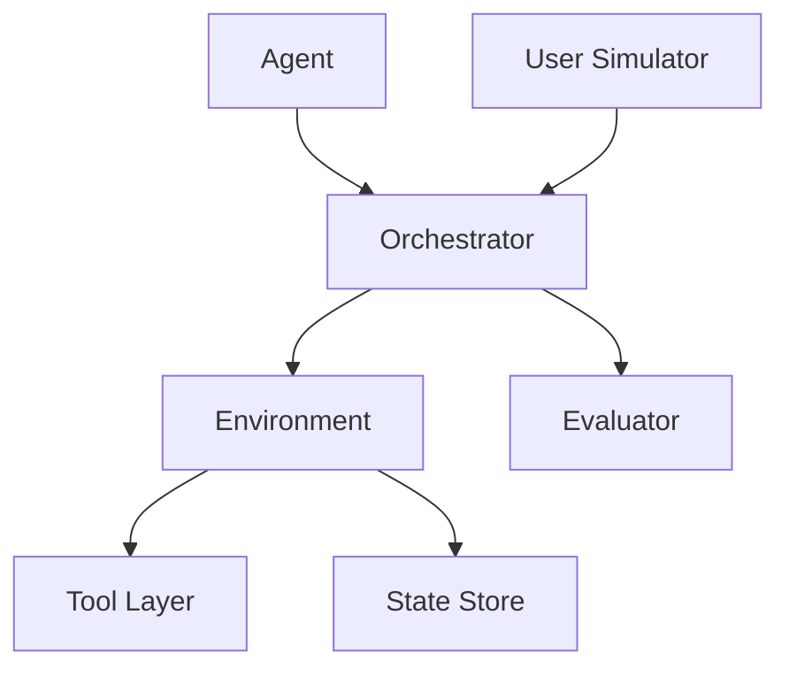
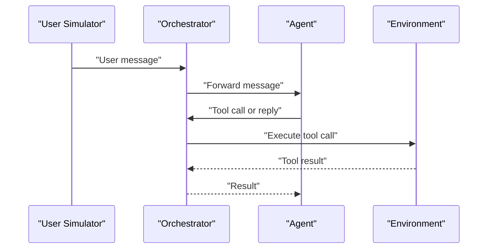
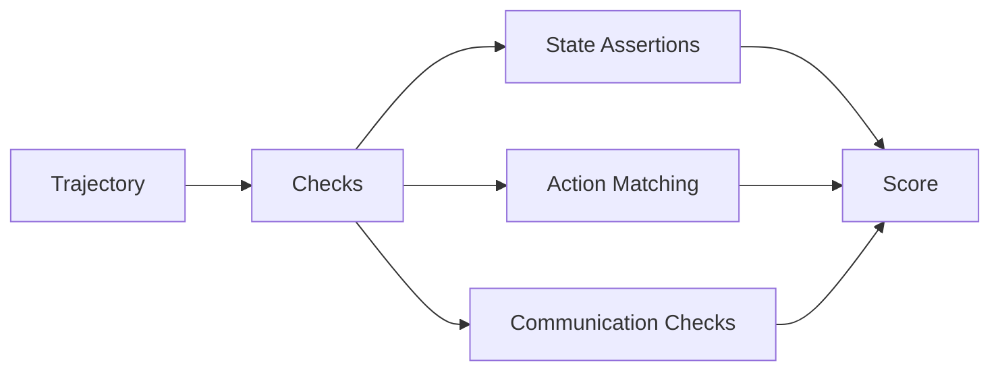

# 09 Mermaid Diagrams

## Component Diagram

## Interaction Sequence

## Evaluation Flow

## Notes
- Replace generic nodes with benchmark-specific components.
- Keep diagrams faithful to code and paper artifacts.
