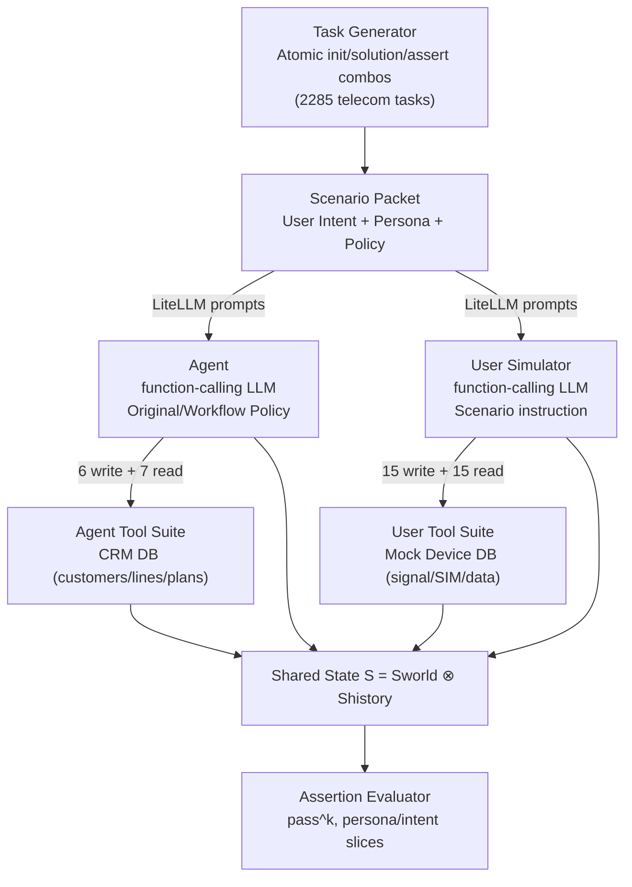
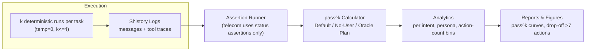

# 09 Mermaid Diagrams

## Component Diagram


_Source: dual-control Dec-POMDP with distinct agent/user tools, telecom task program synthesis, and assertion-based evaluation [paper.txt:217-370][paper.txt:295-358]._

## Interaction Sequence
```mermaid
sequenceDiagram
  participant User as "User Simulator"
  participant Agent as "Agent"
  participant ATools as "Agent Tools"
  participant UTools as "User Tools"

  User->>Agent: "No Service on phone" (persona instruction)
  Agent->>ATools: call get_customer_by_phone("555-123-2002")
  ATools-->>Agent: CRM record (customer_id C1001)
  Agent->>User: "Check airplane mode & status bar"
  User->>UTools: get_network_status()
  UTools-->>User: Airplane Mode ON, SIM invalid
  User->>Agent: Reports findings
  Agent->>User: "Turn off airplane mode"
  User->>UTools: toggle_airplane_mode()
  UTools-->>User: Mode OFF but still No Signal
  User->>Agent: Status update
  Agent->>User: "Reseat SIM card"
  User->>UTools: reseat_sim_card()
  UTools-->>User: SIM active, signal restored
  User->>Agent: Confirms connectivity; tool log closes assertions
```

_Sequence derived from Appendix A.3 telecom trajectory showing alternating tool calls/messages in Default mode [paper.txt:1038-1120]._

## Evaluation Flow


_Evaluation uses deterministic LiteLLM runs, history logs, and assertion-only success checks for telecom, producing pass^k curves by mode/issue/persona/action length [paper.txt:360-585][paper.txt:588-789]._
